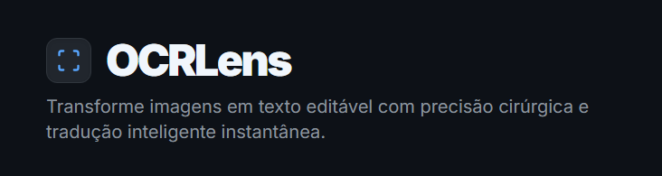

<div align="center">

  <br>

  

  <br>

  [](https://react.dev/)
  [](https://www.typescriptlang.org/)
  [](https://vitejs.dev/)
  [](LICENSE)
</div>


## 💡 O que é o OCRLens?

O **OCRLens** nasceu de uma necessidade real: a busca por uma ferramenta de reconhecimento de texto (OCR) que fosse potente, mas mantivesse a simplicidade. 

Enquanto a maioria das opções gratuitas na web está saturada de anúncios invasivos, limites artificiais de uso ou riscos de segurança, o OCRLens foca no que realmente importa: **qualidade absoluta na extração e processamento de dados**. 

Utilizando modelos de visão computacional avançados, o OCRLens não apenas lê caracteres, ele compreende estruturas, tabelas e parágrafos, entregando um resultado limpo e pronto para uso.

## ✨ Recursos de Elite

* **🎯 Precisão Superior:** Extração fiel de textos complexos e dados estruturados, minimizando erros comuns de interpretação.
* **🌍 Tradução Inteligente Integrada:** Detecte o idioma de origem automaticamente e traduza para o destino desejado no mesmo fluxo.
* **🔓 Versatilidade de Input:** * **Upload:** Suporte a PNG, JPG e WEBP.
    * **Clipboard:** Cole capturas de tela diretamente com `CTRL+V`.
    * **URL:** Processe imagens hospedadas em qualquer servidor web.
* **✂️ Refinamento de Foco:** Ferramenta de recorte (crop) integrada para processar apenas áreas específicas.
* **🛡️ Privacidade em Primeiro Lugar:** Sem rastreadores. Suas chaves de API são armazenadas localmente no seu navegador e nunca saem de lá.


## 🚀 Como Usar e Executar

O OCRLens é agnóstico e respeita sua privacidade. Você pode usar a ferramenta de duas formas:

### 1. Configuração via Interface (Usuário)
Basta abrir a aplicação, acessar o ícone de configurações e inserir sua própria chave de API. Ela será salva de forma segura no seu `localStorage`.

### 2. Desenvolvimento Local (Devs)
```
# Clone o repositório
git clone [https://github.com/seu-usuario/ocrlens.git]

# Instale as dependências
npm install

# Configure seu .env.local
VITE_GEMINI_API_KEY=sua_chave_aqui

# Inicie o projeto
npm run dev
```

## 🛠️ Stack Tecnológica

* **Core:** React 19 & TypeScript
* **Build Tool:** Vite
* **Styling:** Tailwind CSS
* **Ícones:** Lucide React

## 🧠 Manifesto de Desenvolvimento

Este projeto foi totalmente desenvolvido utilizando Inteligência Artificial para elevar o patamar das ferramentas de produtividade open-source.

O OCRLens foi criado para ajudar quem precisa de tecnologia de ponta, mas está cansado de sofrer com soluções que impõem limites artificiais ou que estão repletas de anúncios e riscos de segurança.

Nossa solução é simples na interface, mas extremamente precisa no motor. Focamos na qualidade final da extração e na flexibilidade total, garantindo que a tecnologia trabalhe para você.

##

Se o OCRLens facilitou sua vida ou economizou seu tempo, considere apoiar a criação de mais ferramentas independentes, limpas e seguras.

<div align="center">
  <a href="https://tipa.ai/valesthor" target="_blank">
    
  </a>
</div>

<br>

<div align="center">
<p>© 2026 OCRLens Engine</p>
</div>
